## Neural Core

```console
> whoami
Vidhan Gupta
> education
B.Tech @ NIT Trichy
> focus
AI | ML | Computer Vision | Quant Research
> current_status
Building intelligent systems and real-world AI applications.
> mission
Learn. Build. Innovate.
> reach_me
github.com/VidhanGupta-01
```

## Tech Arsenal

<div align="center">

### AI LAB


### SYSTEMS CORE


### CREATIVE SUITE


### NETWORK HUB


</div>

## GitHub Analytics

<p align="center">
  
  
  
</p>

<p align="center">
  
</p>

## Achievement Matrix

<p align="center">
  
</p>

### Activity Genome

<picture>
  <source media="(prefers-color-scheme: dark)" srcset="https://github.com/VidhanGupta-01/VidhanGupta-01/raw/output/github-contribution-grid-snake-dark.svg" />
  <source media="(prefers-color-scheme: light)" srcset="https://github.com/VidhanGupta-01/VidhanGupta-01/raw/output/github-contribution-grid-snake.svg" />
  
</picture>

### Connect

[](https://www.linkedin.com/in/vidhanguptaofficial)
[](https://github.com/VidhanGupta-01)


[](https://github.com/VidhanGupta-01)

<details>
<summary> Open Neural Core</summary>

```python
while True:
    learn()
    build()
    innovate()
```

</details>

<div align="center">

## Being Creative & Curious


</div>
